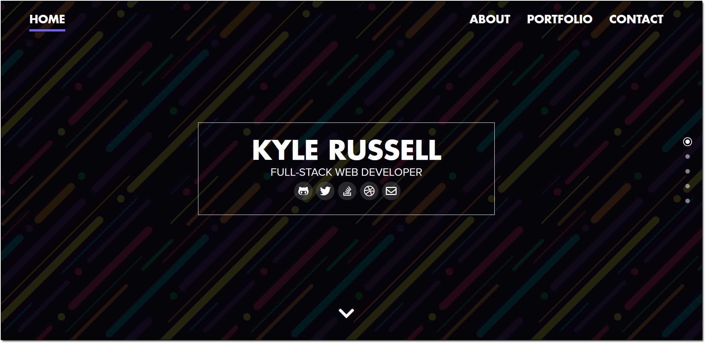
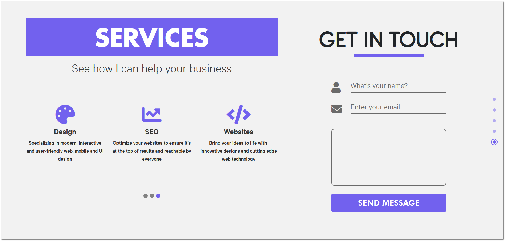
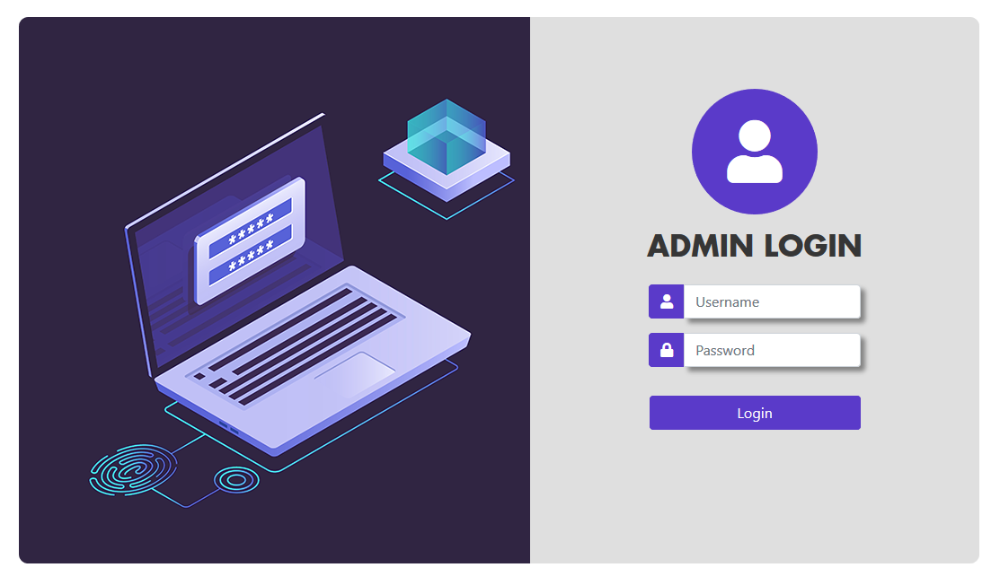

# Personal Website

This personal portfolio project aimed to highlight my open-source projects, blog posts and info about myself.  
Notable features include a single-page mobile freindly UI, repository fetching with Github API, Blog post commenting with social media account authorization and SMTP contacting. There is also a fully fledged admin panel with features including management of users, blog posts, RSS feeds, repositories, site modes, social media and website statistics  
Built with C#/.NET and MSSQL on the backend and jQuery, Sass, HTML + Bootstrap on the frontend.  
To view a live version of the website see [www.kylejoerussell.com](http://www.kylejoerussell.com)

## Previews

## Admin Panel

## License
This project is available under the MIT License  
See [LICENSE](LICENSE) for more details
